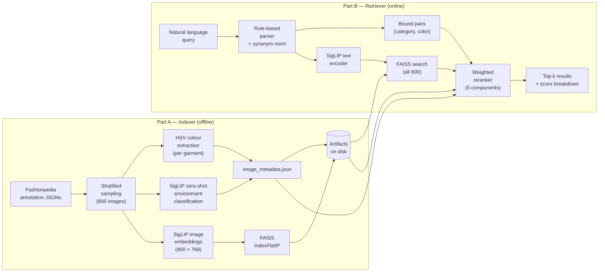

# Glance — Multimodal Fashion Image Retrieval

> **ML Internship Assignment** — Beat a vanilla CLIP+FAISS baseline on compositional and fine-grained fashion queries using the Fashionpedia dataset.

---

## Architecture



---

## Why This Beats Vanilla CLIP+FAISS

| Problem with vanilla CLIP | Glance's solution |
|---|---|
| Holistic embedding can't bind colors to specific garments — confuses "red tie, white shirt" with "white tie, red shirt" | **Bound-pair matching**: per-garment pixel color is extracted from segmentation masks; `(tie, red)` and `(shirt, white)` are scored independently |
| No concept of scene environment | **Zero-shot SigLIP environment classification** against 6 prompts; soft probability stored per image |
| Softmax loss forces inter-class competition | **SigLIP sigmoid loss** scores each image-text pair independently, matching our multi-prompt setup |
| Colors estimated holistically from the entire image embedding | **HSV pixel median** per garment mask — correctly handles navy (dark blue), denim, tan vs gold, etc. |

---

## Setup

```bash
git clone https://github.com/TryingtobeingNikhil/GlanceML.git
cd GlanceML
pip install -r requirements.txt
```

Artifacts (metadata, embeddings, FAISS index) are committed to the repository and will be cloned automatically.

---

## Usage

### CLI Search

```bash
# Single query
python retriever/search.py --query "A red tie and a white shirt in a formal setting." --k 5

# All five evaluation queries at once
python retriever/search.py --all-queries --k 5
```

**Example output:**

```
======================================================================
Query : A red tie and a white shirt in a formal setting.
Parsed: bound=[('tie', 'red'), ('shirt, blouse', 'white')] | env=None | style=formal
──────────────────────────────────────────────────────────────────────
  [1] 217c198d2e6baf302d1b668226e01839.jpg
       final=0.7821  (emb=0.278 | bound=1.000 | loose=None | env=None | style=1.000)
  [2] c0c3c726bdc70bcb5cd84128dc71b108.jpg
       final=0.7714  (emb=0.261 | bound=1.000 | loose=None | env=None | style=1.000)
```

### Python API

```python
from retriever.search import search

parsed_query, results = search("A red tie and a white shirt in a formal setting.", k=5)

for r in results:
    print(r["filename"], r["final_score"])
    print(r["component_scores"])
```

### Demo Notebook

Open `demo.ipynb` in Colab or Jupyter for an interactive walkthrough with image display.

---

## Evaluation Queries

| # | Query | Key challenge |
|---|---|---|
| 1 | A person in a bright yellow raincoat. | Color binding; "raincoat" maps to "coat" (no raincoat category in Fashionpedia) |
| 2 | Professional business attire inside a modern office. | Environment retrieval; style-hint (formal) |
| 3 | Someone wearing a blue shirt sitting on a park bench. | Bound pair + environment; data gap (9 blue shirts, all in office setting) |
| 4 | Casual weekend outfit for a city walk. | Style hint + environment (city → street) |
| 5 | A red tie and a white shirt in a formal setting. | Compositional: two bound pairs must both be correct garments |

---

## Reproducing the Artifacts

Pre-built artifacts are included in the repo. To rebuild from scratch:

```bash
# Step 1 — Build metadata (requires Fashionpedia annotation JSONs and raw images)
python -m indexer.build_metadata \
    --annotations-dir data/annotations \
    --images-dir      data/raw/train2020 \
    --output-dir      artifacts/metadata

# Step 2 — Generate embeddings and build FAISS index
python -m indexer.build_index \
    --metadata-dir  artifacts/metadata \
    --images-dir    data/raw/train2020 \
    --output-dir    artifacts
```

**Annotation JSONs** (not committed — too large):
- `instances_attributes_train2020.json` from [Fashionpedia on HuggingFace](https://huggingface.co/datasets/cvdfoundation/fashionpedia)
- `attributes_train2020.json` from the same dataset

**Raw images** (not committed — 3.5 GB):
- `train2020.zip` from the Fashionpedia S3 bucket.
- Only the 800 indexed images are needed; the notebook uses `remotezip` HTTP range requests to download selectively.

---

## Repository Layout

```
GlanceML/
├── indexer/
│   ├── build_metadata.py   # Annotation parsing, sampling, colour extraction, env classification
│   └── build_index.py      # SigLIP embedding generation + FAISS index build
├── retriever/
│   ├── query_parser.py     # Rule-based parser, synonym normalisation, bound-pair extraction
│   ├── reranker.py         # Weighted scoring (5 components)
│   └── search.py           # Full pipeline — importable + CLI
├── artifacts/
│   ├── metadata/
│   │   └── image_metadata.json     (3.4 MB — 800 images)
│   ├── embeddings/
│   │   ├── image_embeddings.npy    (2.3 MB — 800 × 768 float32)
│   │   └── filename_order.json     (31 KB — row-to-filename mapping)
│   └── faiss_index/
│       └── image_index.faiss       (2.3 MB — IndexFlatIP)
├── config.py               # All tunable parameters in one place
├── demo.ipynb              # Clean Colab-ready demonstration notebook
├── notebook.ipynb          # Original development notebook (reference)
├── requirements.txt
└── report.md               # Full assignment report
```

---

## Design Decisions

### SigLIP over CLIP
SigLIP uses a **sigmoid** (per-pair) training loss, not softmax. Each image-text pair is scored independently — which is exactly what our multi-prompt attribute matching needs. OpenCLIP's softmax loss forces the scores to compete within a batch, which degrades multi-label retrieval. The base-size checkpoint (`siglip-base-patch16-224`) is deliberate at 800 images; larger checkpoints would improve recall but are unnecessary at this scale.

### HSV colour over RGB Euclidean distance
An earlier prototype used nearest-neighbour distance in RGB space. It systematically mislabelled desaturated hues as grey (a light-blue jacket → "grey"; a navy tie → "green") because RGB distance conflates brightness with hue. HSV separates these dimensions: the saturation threshold identifies neutral vs. chromatic colours first, then the hue angle assigns chromatic colours, with saturation/value refinements for fashion-specific sub-names (navy, denim, tan, olive, maroon, gold).

### FAISS IndexFlatIP (flat, exact)
800 vectors fit entirely in memory; brute-force search takes under a millisecond. Approximate indices (IVF, HNSW, PQ) only pay off past ~100K–1M vectors. At that scale, the index type and the retrieval strategy (currently: retrieve all 800, then rerank all 800) would both need to change — see `report.md §Scalability`.

### Bound-pair matching (the compositionality fix)
CLIP embeds the full query holistically, so "red tie, white shirt" and "white tie, red shirt" produce nearly identical embeddings. The bound-pair scorer checks each `(category, colour)` pair at the pixel level — a garment must have _both_ the right category and the right colour. Critically, terms already matched as a bound pair are excluded from the loose-attribute scorer to prevent double-counting (this was a real bug caught and fixed in Cell 18b of the development notebook).

---

## Known Limitations

1. **Query 1 ("yellow raincoat")** — only 1 matching image in the 800-image set. Fashionpedia has no "raincoat" category; all coats are labelled "coat". The indexed sample was intentionally not pre-optimised for the evaluation queries to avoid overfitting.

2. **Query 3 ("blue shirt, park bench")** — 9 blue shirt/blouse instances in the index, all in office environments (max park probability = 0.0069). No reranker weight tuning can fix a genuine data gap.

3. **Fashionpedia dataset bias** — dominated by runway/editorial photography, not candid lifestyle photos. Environment classification is inherently noisier here than it would be on a geographically-diverse dataset.

4. **Environment labels are zero-shot, not ground truth** — treat as noisy signal. The soft probability vector (stored per image) is used in scoring, not just the argmax label.

5. **Single dominant colour per garment** — pattern-heavy garments (plaid, print, ombre) are averaged to one colour, losing multi-colour information.

---

## Future Work

See `report.md §Future Work` for detailed discussion of:
- Extending to real locations, weather, and geographic context
- Perceptual (LAB-space) colour distance, learned cross-encoder reranking, SigLIP fine-tuning
- Scalability path to 1M images

---

## License

Educational use only (ML internship assignment). Fashionpedia data subject to its [original licence](https://github.com/cvdfoundation/fashionpedia).
